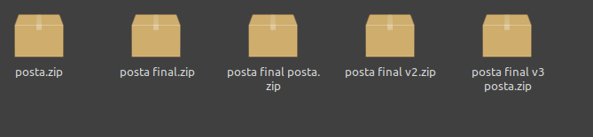

# Git 101 

## Qué es Git?
Es un sistema de control de versiones.  Nos permite mantener la historia de un proyecto y trabajar en equipo de forma fácil y efectiva. Si bien no es el único (SVN, CVS), es definitivamente el más usado en la industria por ser muy flexible y performante.

## Para qué me sirve?

En parte, para evitar esto:



Pero Git no sólo nos permite saber cuál es la versión más reciente de un proyecto, sino que va a facilitar a disintos miembros del equipo trabajar en paralelo, incluso sobre un mismo archivo. También nos va a ayudar a separar las versiones de código que están listas para producción (siendo usadas por los usuarios finales) de las que aún estan en etapa de desarrollo / testing, etc. También nos da trazabilidad sobre los cambios del código, quién escribió tal línea de código, por qué, y cuándo. 

## Git no es GitHub

Git es un programa que corre en nuestrad computadoras, y regista los cambios que hacemos sobre un conjunto de archivos. Esta información se guarda en un repositorio, es decir, una carpeta donde se van guardando los cambios que se efectuan sobre los archivos. 
Si queremos trabajar en equipo, necesitamos un repositorio al que todes podamos acceder. Es entonces cuando buscamos un servidor que albergue el repositorio. Podemos usar un servidor local (en la oficina, por ejemplo), o más típicamente usar uno en la nube, como GitHub, GitLab, o Bitbucket.

## Instalación

#### 1.1 Linux: `apt get`

```bash
# actualiza el repositorio ("listado") de aplicaciones
sudo apt-get update

# instala git
sudo apt-get install git

# checkea la instalación
git --version
> git version 2.9.2
# seguramente veas un número más grande, está bien

```

#### 1.2 Windows: 

#### Bajá el [instalador](https://git-for-windows.github.io/) y seguí los pasos.

### 2. Configuralo

```bash
# linux / windows friendly
git config --global user.name "Bad Luck Brian"
git config --global user.email "brian@badLuck.com
```

### 3. Opcional: Instalá una GUI 

Git se puede trabajar integramente desde la consola de comandos. Esto puede resultar un poco vertiginoso al comienzo, así que te recomiendo usar alguna interfaz gráfica que te la haga más facil. Hay [muchísimas](https://git-scm.com/downloads/guis) para elejir. En este tutorial vamos a usar GitKraken

#### 3.1 Linux:

##### 3.1.1 .deb

Bajálo [acá](https://gitkraken.com/download/linux-deb), abrilo y se instala de una.

##### 3.1.2 Snap Store (viene instalada por defecto en Ubuntu 16 para arriba)

```bash

# verificá tener snap instalado
sudo apt install snapd

sudo snap install gitkraken --classic
# si tira error porque no tenemos snap instalado, 

```

##### 3.2 Windows:

Bajá el [instalador](https://www.gitkraken.com/download) y seguí los pasos.

## Arrancamos

### `Init`ializa un repo

Vamos a empezar creando un repositorio local en cada una de nuestras PCs.

Git trackea todo tipo de archivos, pero los que son de texto (`.txt`, `.md`, `.java`, `.js`, etc.) nos van a dar más claridad sobre el proceso. 

#### Opción 1: Terminal

```bash
# cd hasta la carpeta del proyecto
git init
```

#### Opción 2: Git Kraken

` Menu > File > Init Repo ` 

Seleccioná la carpeta del proyecto, el resto dejá los valores default.

#### Chequéa

Ahora podemos ver que hay una nueva carpeta. `.git` adentro de la carpeta del proyecto. Esta carpeta está oculta por buenas razones, NO TOCAR!

### `Commit` loop

Un `commit` es un conjunto de cambios realizados en un proyecto. El estado final del proyecto, es la suma de todos los cambios que vivió. los commits de git son livianos porque cuando actualizo no me traigo TODO el código, sino los cambios.

El workflow habitual en git es

1. Hacer cambios
2. Agregar cambios al `staging`
3. `Commit`ear los cambios
4. Volver al paso 1

```bash
# ver cambios
git status

# agregar cambios hechos a algún archivo al staging
git add <NOMBRE DE ARCHIVO>
# o 
git add . # agrega TODOS los cambios

# commitea
git commit 
# o 
git commit -m "<TEXTO ACA>"
```

Buenas Prácticas

* commits pequeños
* commits funcionales y atómicos
* nombres descriptivos

### Repos `remote`

#### Opción 1: Desde un proyecto local

... crear usuario y primer repo en github

```bash
# vinculamos "<remote_name>" con la url del repositorio hosteado en github
git remote add <remote_name> <remote_repo_url>

# "pusheamos" el estado del repo hasta el último commit al repo remoto
git push -u <remote_name> master
# la "u" setea <remote_name> como el remoto default

## "<remote_name>" puede ser el cualquiera, el nombre estandar es "origin"
```

#### Opción 2: Clonar un proyecto existente

```bash
# vinculamos "<remote_name>" con la url del repositorio hosteado en github
git clone <remote_repo_url>
```

### `push`eando y `pull`eando

```bash
# traemos los commits del remoto a nuestro repo
git fetch
```

### Ramas

```bash
# creo la rama
git branch <nombreDeRama>
# me paro en la rama
git checkout <nombreDeRama>
```

### `merge`

```bash
# me paro en la rama a la que quiero mergear, no necesariamente es master
git checkout master
# me traigo los cambios
git merge <rama a mergear>
```

### 